# BMad Method — Annotated User Guide

This annotated guide augments the standard flowcharts with explicit commands and cues for an optimal day‑to‑day developer workflow. The diagrams use concise command snippets inside nodes. Run commands in the project root unless noted otherwise.

## The Planning Workflow (Annotated)

```mermaid
%%{init: {"flowchart": {"htmlLabels": false}} }%%
flowchart TD
    A[Start: Project Idea] --> B{Optional: Analyst Research}
    B -->|Yes| C[Analyst: Brainstorming (Optional)]
    B -->|No| G{Project Brief Available?}
    C --> C2[Analyst: Market Research (Optional)]
    C2 --> C3[Analyst: Competitor Analysis (Optional)]
    C3 --> D[Analyst: Create Project Brief]
    D --> G
    G -->|Yes| E[PM: Create PRD from Brief (Fast Track)]
    G -->|No| E2[PM: Interactive PRD Creation (More Questions)]
    E --> F[PRD created with FRs, NFRs, Epics and Stories]
    E2 --> F
    F --> F2{UX Required?}
    F2 -->|Yes| F3[UX Expert: Create Front End Spec]
    F2 -->|No| H[Architect: Create Architecture from PRD]
    F3 --> F4[UX Expert: Generate UI Prompt for Lovable/V0 (Optional)]
    F4 --> H2[Architect: Create Architecture from PRD + UX Spec]
    H --> Q{Early Test Strategy?}
    H2 --> Q
    Q -->|Yes| R["`QA: early input on high-risk areas
cmd: @qa *risk AREA
cmd: @qa *design AREA`"]
    Q -->|No| I
    R --> I[PO: Run Master Checklist]
    I --> J{Documents Aligned?}
    J -->|Yes| K["`Planning complete
cmd: git tag plan-v1`"]
    J -->|No| L[PO: Update Epics and Stories]
    L --> M[Update PRD/Architecture as needed]
    M --> I
    K --> N[Switch to IDE]
    N --> O["`Shard documents
cmd: @po shard docs/prd.md
cmd: @po shard docs/architecture.md`"]
    O --> P["`Ready for SM/Dev cycle
cmd: npx bmad-method install
cmd: coordinate pm→sm→researcher→qa→po→dev per focused-epic workflow
cmd: npm run bmad:validate`"]
```

## The Core Development Cycle (Annotated)

```mermaid
%%{init: {"flowchart": {"htmlLabels": false}} }%%
flowchart TD
    A["`Development phase start
sync main
cmd: git checkout main
cmd: git pull --ff-only upstream main
cmd: git push origin main`"] --> B[SM: review previous notes]

    B --> B2["`SM: draft next story
source: sharded epic + architecture
commit: docs/stories/STORY_ID.md`"]

    B2 --> S{High-risk story?}
    S -->|Yes| T["`QA early strategy
cmd: @qa *risk STORY_ID
cmd: @qa *design STORY_ID`"]
    S -->|No| B3[Proceed]
    T --> U[Risk profile ready]

    U --> B3
    B3 --> C{PO/User approval?}
    C -->|Approved| D["`Dev: create feature branch
cmd: git checkout -b feat/BRANCH_SLUG`"]
    C -->|Needs changes| B2

    D --> E["`Dev: implement tasks and tests
run validations often
cmd: npm run bmad:validate
cmd: npm test (or pytest)`"]

    E --> V{Mid-dev QA check?}
    V -->|Yes| W["`QA trace/NFR
cmd: @qa *trace STORY_ID
cmd: @qa *nfr STORY_ID`"]
    V -->|No| F[Proceed]

    W --> X[Dev: address gaps]
    X --> F[Dev: run all validations]

    F --> G[Ready for review]
    G --> H{QA review or direct approve?}

    H -->|QA review| I["`QA: review + gate
cmd: @qa *review STORY_ID
cmd: @qa *gate STORY_ID`"]
    H -->|Direct approve| M[Verify CI, lint, tests locally]
    H -->|Needs fixes| D

    I --> L{QA decision}
    L -->|Needs dev work| D
    L -->|Approved| M

    M --> N["`Commit and push
    cmd: git add -A
    cmd: git commit -m 'feat: STORY_ID'
    cmd: git push -u origin feat/BRANCH_SLUG`"]
    N --> PR["`Open PR to main
cmd: gh pr create --fill --base main`"]
    PR --> RREV{Review outcome}
    RREV -->|Changes requested| D
    RREV -->|Approved| MERGE["`Merge PR
cmd: gh pr merge --squash --delete-branch`"]
    MERGE --> SYNC["`Sync local
cmd: git checkout main
cmd: git pull --ff-only origin main`"]
    SYNC --> K["`Mark story done
cmd: @qa *gate STORY_ID`"]
    K --> B
```



### Notes

- Replace `{story}` and `{slug}` with your actual identifiers.
- If your project does not have `npm run bmad:validate`, use the validator the installer added for your ecosystem, or skip that line.
- For repositories mirroring an upstream, prefer: `git pull --ff-only upstream main` then `git push origin main`.
